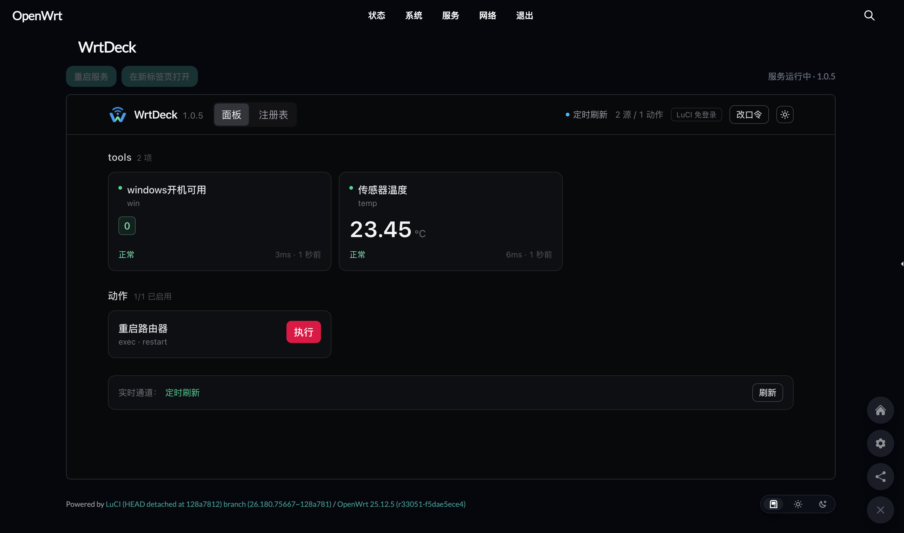
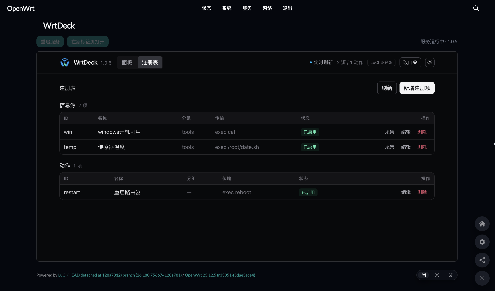
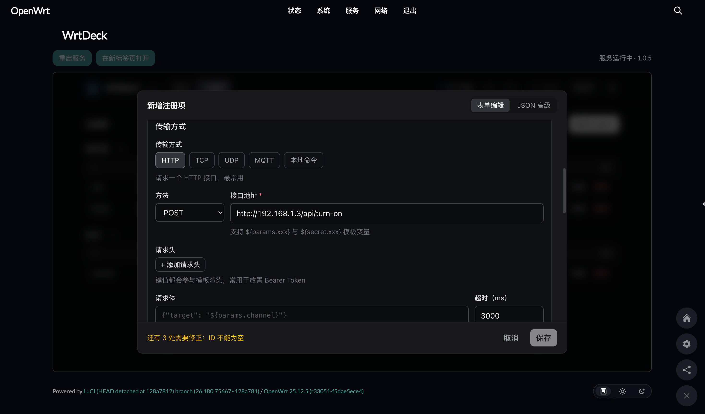

<p align="center">
  
</p>

# WrtDeck

WrtDeck 运行在 OpenWrt 设备上，是一个硬件资源占用较低的设备监控与控制面板。它通过 JSON 格式的注册表配置，把局域网中 HTTP、TCP、UDP、MQTT 设备的状态指标与控制动作转变成网页控制台里的状态卡片和操作按钮。

- 完整安装与升级指南：[docs/INSTALL.md](./docs/INSTALL.md)
- 本地开发与构建测试：[docs/DEVELOPMENT.md](./docs/DEVELOPMENT.md)
- 架构设计与系统原理：[docs/ARCHITECTURE.md](./docs/ARCHITECTURE.md)
- 项目协作规范：[AGENTS.md](./AGENTS.md)

## 特性

- **轻量独立**：单二进制文件采用 Go 静态编译，不依赖设备系统里的 libc 版本，前端静态资源已内置在二进制中。
- **协议支持**：支持 HTTP、TCP、UDP、本地程序 Exec（支持系统 PATH 命令与安全黑名单）以及 MQTT 3.1.1（无第三方依赖，支持断线重连与主题订阅）。
- **LuCI 免密集成**：提供体积仅 10 余 KB 的 `luci-app-wrtdeck` 扩展包，直接把面板页面内嵌到 LuCI 管理界面中，同域名同端口访问，跟随主路由 HTTPS，免重复输入口令。
- **公网防御配置**：默认只监听回环地址；包含强制首次改密、登录失败来源指数退避封禁、IPv6 网段限速、受信任反向代理识别、Host 请求头过滤、写接口同源校验与临时目录禁止执行机制。
- **双配色支持**：内置浅色与深色界面，支持自动跟随操作系统设置或手动锁定。

## 界面预览

**控制面板**（内嵌于 LuCI 页面，展示实时指标与控制动作）：



**注册表配置**（直接在网页增减与调试设备信息源）：



**注册项编辑**（支持可视化表单与原始 JSON 双向编辑，带实时参数校验）：




## 资源占用

设备运行时的硬件资源开销如下：

| 项目 | 实际指标 |
| :--- | :--- |
| 常驻内存 | 约 8–12 MB（随配置的设备项数量小幅浮动） |
| 安装包大小 | 面板安装包约 3.2 MB，LuCI 薄壳包约 13 KB |
| 运行时依赖 | 仅依赖路由器自带的 `ca-bundle`（用于 HTTPS 请求） |

## 快速安装

从 [Releases](../../releases) 页面下载对应硬件架构的安装包，通过 `scp` 或 U 盘传入路由器。

### 1. 安装面板本体

根据设备系统的 OpenWrt 版本选择安装命令：

```sh
# OpenWrt 25.12 及更新版本（使用 apk）
apk update
apk add --allow-untrusted ./wrtdeck-1.0.5-r1.apk

# OpenWrt 24.10 及更早版本（使用 opkg）
opkg update
opkg install ./wrtdeck_1.0.5-1_aarch64_cortex-a53.ipk
```

主流 ARM64 路由器使用默认的 `aarch64_cortex-a53` 架构包；x86 软路由请下载 `x86_64` 包；老旧机型请按 CPU 型号下载 `arm_cortex-a7`、`mipsel_24kc` 或 `mips_24kc` 对应包。

### 2. 安装 LuCI 薄壳（可选）

设备若运行了 LuCI 网页后台，可安装薄壳包将控制台集成到路由器后台菜单中：

```sh
# apk 格式设备
apk add --allow-untrusted ./luci-app-wrtdeck-1.0.5-r1.apk

# ipk 格式设备
opkg install ./luci-app-wrtdeck_1.0.5-1_all.ipk
```

薄壳包安装后，刷新路由器后台即可在「服务 → WrtDeck」中打开控制面板。

## 初始访问与登录

安装完成后服务会自动启动：

1. **访问入口**：
   - 安装了 LuCI 薄壳：打开路由器后台，进入「服务 → WrtDeck」，系统自动完成免密交接进入面板。
   - 独立运行访问：若在 `config.json` 中配置了对外监听端口，使用浏览器访问对应端口打开网页。
2. **初始口令**：首次启动的默认管理口令为 `admin`。首次成功登录后，系统强制跳转至改密页面，修改口令后方可正常使用。
3. **API Token**：如果需要通过外部脚本或自动化工具调用 API，执行以下命令查看当前系统的长效 Token：
   ```sh
   /etc/init.d/wrtdeck token
   ```

## 配置文件与数据保存

- 主配置文件：`/etc/wrtdeck/config.json`
- 凭据与加密数据：`/etc/wrtdeck/secrets.json`
- 注册表定义：`/etc/wrtdeck/registry.json`

升级安装包时，用户的口令、自定义注册项和修改过的配置会保留，不会被覆盖。如需调整监听端口或配置受信任反代，直接编辑 `/etc/wrtdeck/config.json` 并重启服务：

```sh
/etc/init.d/wrtdeck restart
```

## 开源协议

本项目基于 [MIT License](./LICENSE) 协议开源。